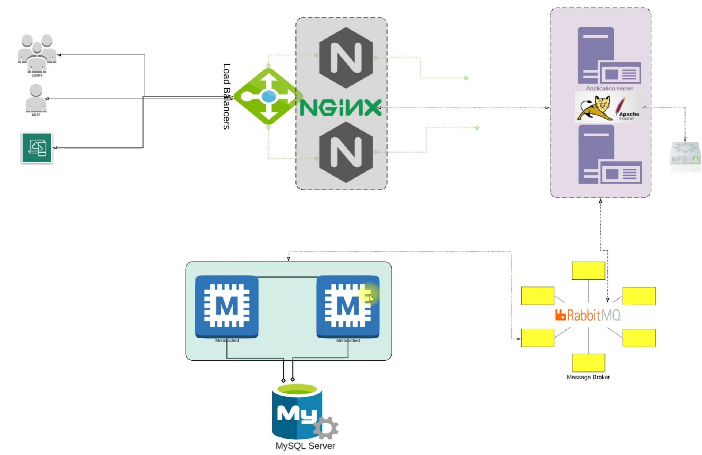

# Java Web Service Stack Local R&D Environment Manual and Auto Setup

## Introduction
In this project, a R&D application stack to serve Java web application was set up locally either manually or automated. We used vagrant to achieve this setup.

- The directory for manually set up: [Manual setup](vagrant/manual)
- The directory for automated set up: [Automated setup](vagrant/auto)

The content is divided into a few sections:

- [Java Web Service Stack Local R\&D Environment Manual and Auto Setup](#java-web-service-stack-local-rd-environment-manual-and-auto-setup)
  - [Introduction](#introduction)
  - [Prerequisite](#prerequisite)
  - [Architecture Stack](#architecture-stack)
  - [Manual Provisioning](#manual-provisioning)
  - [Automated Provisioning](#automated-provisioning)

## Prerequisite
- Oracle VM Virtualbox (version: 7.0.8 r156879)
- Vagrant (version: 2.3.7)
- Vagrant plugins:
  - ```vagrant plugin install vagrant-hostmanager```
- Git bash or equivalent editor

## Architecture Stack
Please refer the following diagram for the servers that is included in this project setup. There are five services to be set up:
- Nginx: A reverse proxy server
- Tomcat: Java web application backend server
- Memcache: Database caching service
- RabbitMQ: Message queueing broker
- MySQL: SQL database to store user info



The Java application is a simple login website deployed on Tomcat. The user and password are stored in MySQL database for authentication and will be stored in a memcache caching service for fast next time retrieving. The Java web application source code structure is located in [src](src) directory
## Manual Provisioning
Please refer to [README.md](vagrant/manual/README.md) for detailed steps.

## Automated Provisioning
Please refer to [README.md](vagrant/auto/README.md) for detailed info.

