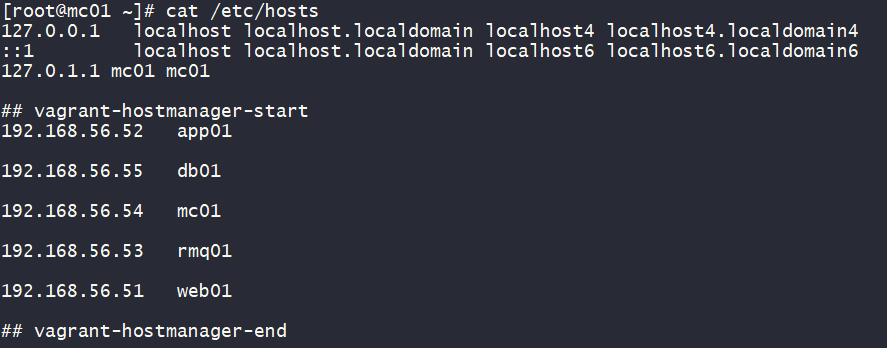

# Manual Provisioning

## Before provisioning

Note: For Windows users, disable the following Windows features to prevent any potential interference: Hyper-V, Virtual Machine Platform, Windows Hypervisor Platform, and Windows Subsystem for Linux. And after disabling the features, restart the computer.

We will perform validation on the running virtual machines (VMs). Following that, we will proceed with provisioning the VMs. Once the provisioning process is complete, we will carry out validation on the services.

## VM Setup
1. Run `git switch main`
2. CD into `vagrant/manual` directory
3. Open Git Bash and execute `vagrant up`

A successful execution will bring the command prompt back to the user.

## VM Validation

```bash
vagrant status

vagrant ssh db01 # and mc01, rmq01, app01, web01 in turn
sudo cat /etc/hosts
```
The valid output should be similar to the following:



The VM is now ready for provisioning.

## Provisioning

Provisioning will be done in the following order (from backend to frontend):

1. MySQL
2. Memcached
3. RabbitMQ
4. Tomcat
5. Nginx

Run the following commands in order in Git Bash:
### 1. MySQL


**a. Install MySQL**

```bash
vagrant ssh db01

sudo -i

yum update -y

yum install epel-release -y

yum install git mariadb-server -y

systemctl start mariadb
systemctl enable mariadb
```

**b. Configure MySQL**

```bash
mysql_secure_installation

Enter current password for root (enter for none): <enter>

Switch to unix_socket authentication [Y/n] y

Change the root password? [Y/n] y

New password: adminpass
Re-enter new password: adminpass

Remove anonymous users? [Y/n] y

Disallow root login remotely? [Y/n] n

Remove test database and access to it? [Y/n] y

Reload privilege tables now? [Y/n] y

```

**c. Create database and user**

```bash
mysql -u root -padminpass  # -p and password without any space in between
```

```sql
mysql> create database accounts;
mysql> grant all privileges on accounts.* to 'admin'@'%' identified by 'adminpass';
mysql> flush privileges;
mysql> show databases;
mysql> exit;
```

**d. Populate the database**

```bash
git clone -b main https://github.com/jackycwwang/java-web-service-stack-local-RandD-env-setup-automation.git
cd java-web-service-stack-local-RandD-env-setup-automation
mysql -u root -padminpass accounts < src/main/resources/db_backup.sql
mysql -u root -padminpass accounts
```

Show tables and exit.

```sql
mysql> show tables;
mysql> exit;
```

Restart MariaDB.

```bash
systemctl restart mariadb
```
Done!

### 2. Memcached

```bash
vagrant ssh mc01

sudo -i

dnf install epel-release -y

dnf install memcached -y

systemctl start memcached
systemctl enable memcached
systemctl status memcached


sed -i 's/127.0.0.1/0.0.0.0/g' /etc/sysconfig/memcached
cat /etc/sysconfig/memcached
systemctl restart memcached
systemctl status memcached
```

Done!

## 3. RabbitMQ

```bash
vagrant ssh rmq01

sudo -i

yum update -y

yum install epel-release -y

cd /tmp

dnf -y install centos-release-rabbitmq-38
dnf --enablerepo=centos-rabbitmq-38 install rabbitmq-server -y

systemctl start rabbitmq-server
systemctl enable rabbitmq-server
systemctl status rabbitmq-server

sh -c 'echo "[{rabbit, [{loopback_users, []}]}]." > /etc/rabbitmq/rabbitmq.config'
cat /etc/rabbitmq/rabbitmq.config

rabbitmqctl add_user test test
rabbitmqctl set_user_tags test administrator

systemctl restart rabbitmq-server
systemctl status rabbitmq-server
```

Done!


## 4. Tomcat

**a. Install Dependencies and Tomcat**

```bash
vagrant ssh app01

sudo -i

yum update -y

yum install epel-release -y

dnf -y install java-11-openjdk java-11-openjdk-devel

dnf install git maven wget -y

cd /tmp

wget https://archive.apache.org/dist/tomcat/tomcat-9/v9.0.75/bin/apache-tomcat-9.0.75.tar.gz

tar -xzvf apache-tomcat-9.0.75.tar.gz

useradd --home-dir /usr/local/tomcat --shell /sbin/nologin tomcat
ls -l /usr/local

cp -r apache-tomcat-9.0.75/* /usr/local/tomcat/

chown -R tomcat.tomcat /usr/local/tomcat
ls -l /usr/local/tomcat
```

**b. Configure Tomcat to enable systemctl control**

Create a file called `tomcat.service` in `/etc/systemd/system/` directory.

```bash
vi /etc/systemd/system/tomcat.service
```

Copy the following into the file and save it.

```ini
[Unit]
Description=Tomcat
After=network.target

[Service]
User=tomcat
WorkingDirectory=/usr/local/tomcat
Environment=JRE_HOME=/usr/lib/jvm/jre
Environment=JAVA_HOME=/usr/lib/jvm/jre
Environment=CATALINA_HOME=/usr/local/tomcat
Environment=CATALINE_BASE=/usr/local/tomcat
ExecStart=/usr/local/tomcat/bin/catalina.sh run
ExecStop=/usr/local/tomcat/bin/shutdown.sh
SyslogIdentifier=tomcat-%i

[Install]
WantedBy=multi-user.target
```

Reload the daemon and start Tomcat.

```bash
systemctl daemon-reload
systemctl start tomcat
systemctl enable tomcat
systemctl status tomcat
```

**c. Code build and deploy**

```bash
git clone https://github.com/jackycwwang/java-web-service-stack-local-RandD-env-setup-automation.git

cd java-web-service-stack-local-RandD-env-setup-automation

mvn install

systemctl stop tomcat

rm -rf /usr/local/tomcat/webapps/ROOT*
cp target/vprofile-v2.war /usr/local/tomcat/webapps/ROOT.war

systemctl start tomcat
ls -l /usr/local/tomcat/webapps

chown tomcat.tomcat /usr/local/tomcat/webapps -R
systemctl restart tomcat
systemctl status tomcat
```

Done!


## 5. Nginx

**a. Install Nginx**

```bash
vagrant ssh web01

sudo -i

apt update && apt upgrade -y

apt install nginx -y

```

**b. Configure Nginx**

Create a file called `vprofile` in `/etc/nginx/sites-available/` directory.

```bash
vi /etc/nginx/sites-available/vprofile
```

Copy the following into the file and save it.


```nginx
upstream vproapp {
  server app01:8080;
}

server {
  listen 80;
  location / {
    proxy_pass http://vproapp;
  }
}
```

Remove default nginx conf and create a symbolic link to enable the site.

```bash
rm -rf /etc/nginx/sites-enabled/default
ln -s /etc/nginx/sites-available/vprofile /etc/nginx/sites-enabled/vprofile

ls -l /etc/nginx/sites-enabled
```

**c. Restart Nginx**

```bash
systemctl restart nginx
systemctl status nginx
```

All done!

# Service Validation

Enter `http://192.168.56.51` in the browser. The following page should be displayed:


Enter username `admin_vp` and password `admin_vp` (one of credentials in MySQL) to login.


<sub>The photos and source code are taken from &copy; HKH Infotech.</sub>